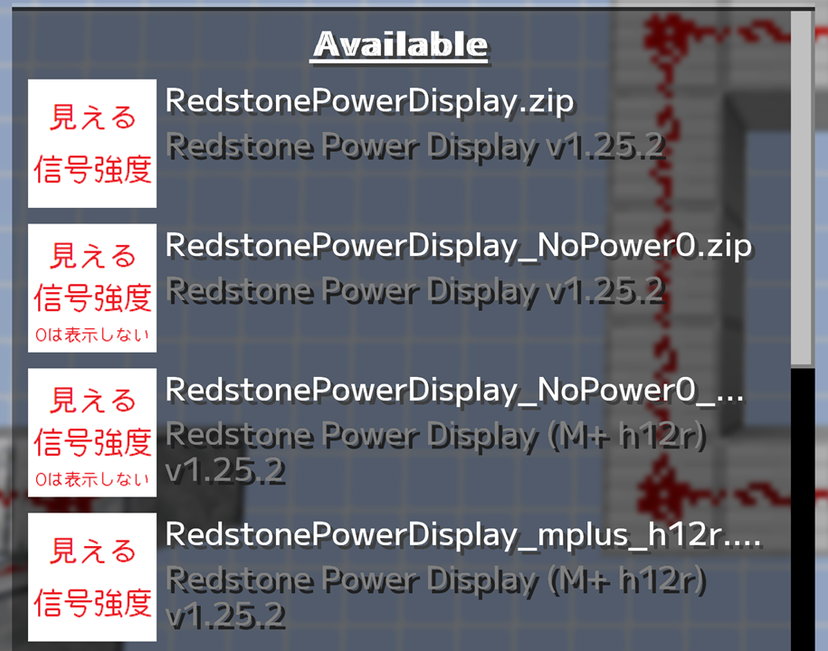
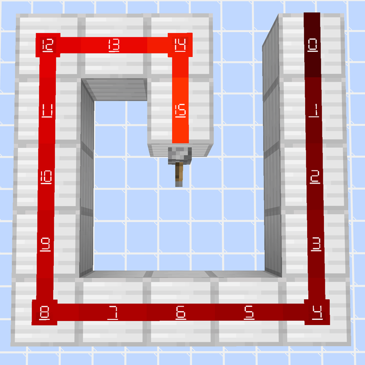
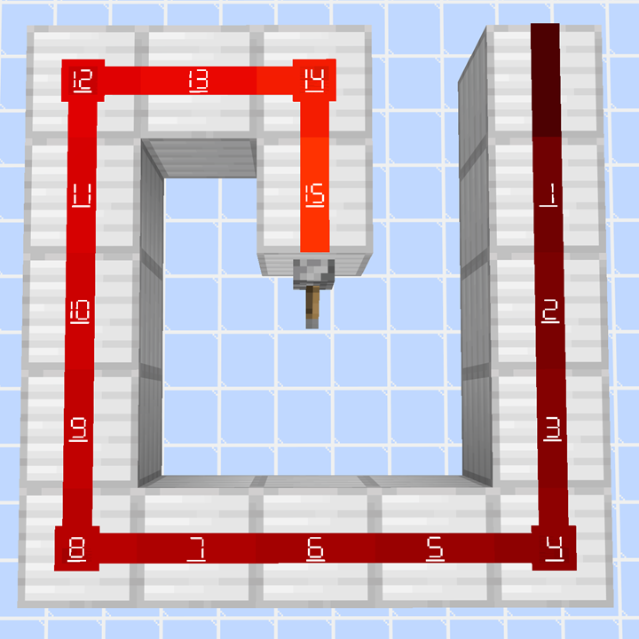
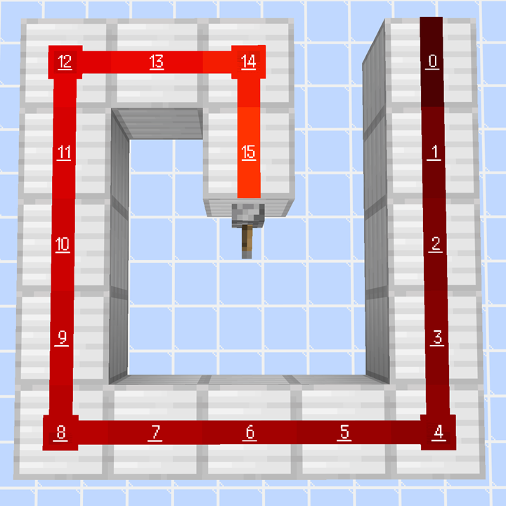
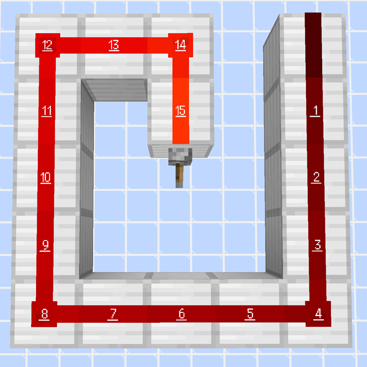

# Redstone Power Display

The Minecraft resource pack, ``Redstone Power Display,'' replaces redstone wire textures and displays the redstone power level.

レッドストーンパウダーのテクスチャを置き換え、レッドストーン信号強度を見えるようにするマインクラフトのリソースパックです。

レッドストーン信号強度が０の場合、０も表示するバージョンと、０は表示しないバージョン、それぞれを別に用意しています。

## Latest Version

1.25.1

## Variants

`RedstonePowerDisplay.zip` - Overlay '0' when a redstone dust is not powered.

`RedstonePowerDisplay_NoPower0.zip` - Don't display '0' when a redstone dust is not powered.

mplus_h12r : font is M+ bitmap hlv 12r

M+ Fonts  
[https://mplusfonts.github.io/](https://mplusfonts.github.io/)

M+ bitmap  
[https://github.com/coz-m/MPLUS_FONTS/tree/master/obsolete](https://github.com/coz-m/MPLUS_FONTS/tree/master/obsolete)

## For Java Edition (26.1/26.1.1/26.1.2/26.2 or later)

1.) Download the resource pack from the `1.25.1` directory.

2.) Place it in `C:\Users\<Username>\AppData\Roaming\.minecraft\resourcepacks`

## For Java Edition (1.21.9/1.21.10/1.21.11)

Try version 1.24.3, as these files are stored in the `1.24.3` directory.

## For older Java Edition

[Old Releases](OLD_RELEASES.md)

## Images

### `Select Resource Packs` Image / `リソースパックの選択` 画面イメージ

### RedstonePowerDisplay.zip

7SEG Font w/ 0 / ０表示あり７セグフォント

### RedstonePowerDisplay_NoPower0.zip

7SEG Font w/o 0 / ０表示なし７セグフォント

### RedstonePowerDisplay_mplus_h12r.zip

M+ Font w/ 0 / ０表示あり M+ フォント

### RedstonePowerDisplay_NoPower0_mplus_h12r.zip

M+ Font w/o 0 / ０表示なし M+ フォント

